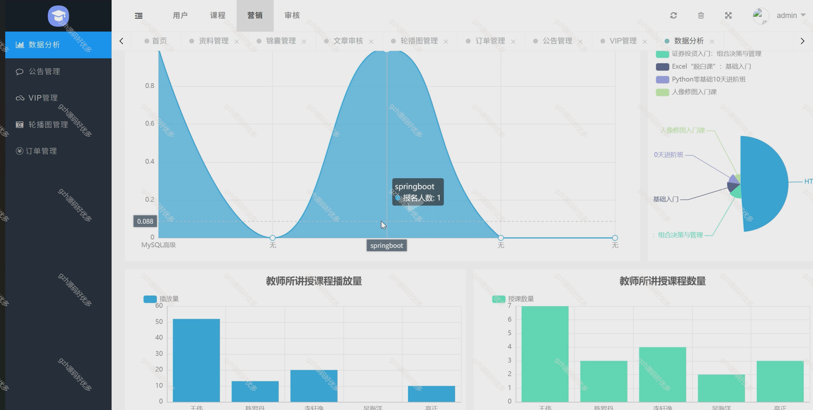
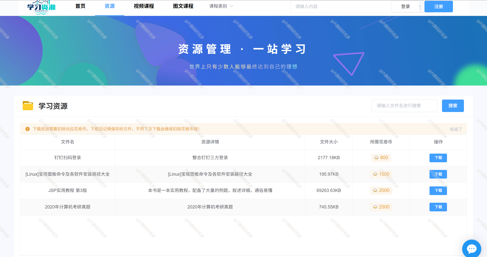
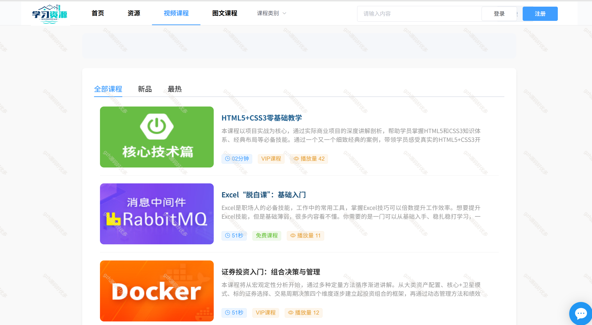
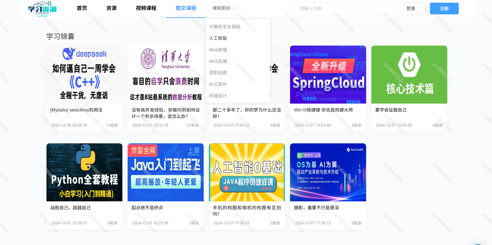
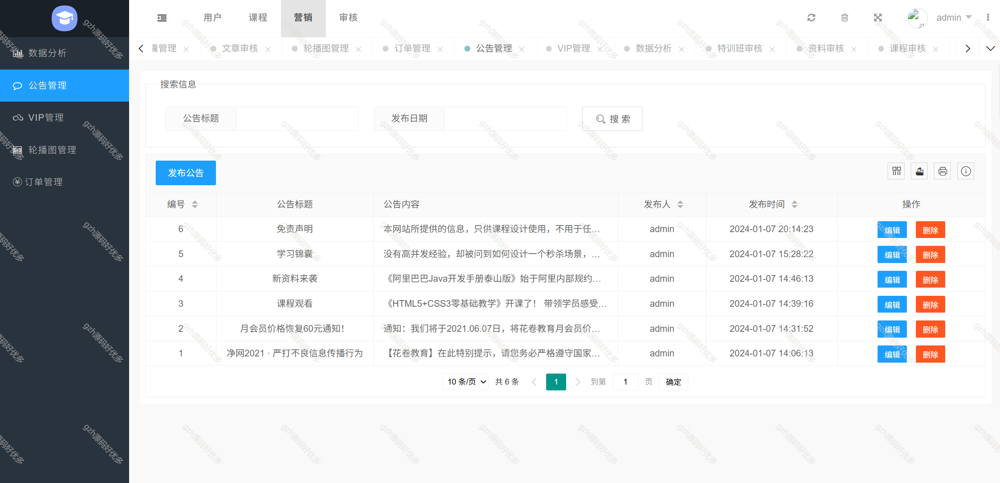
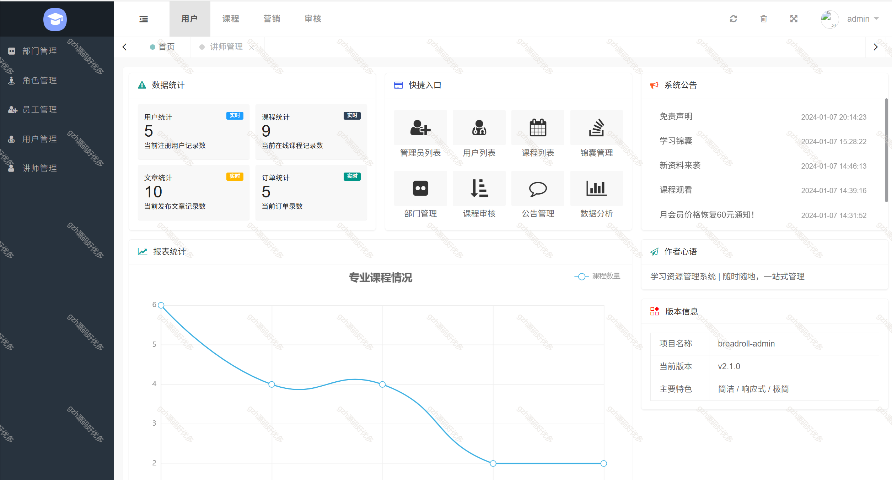
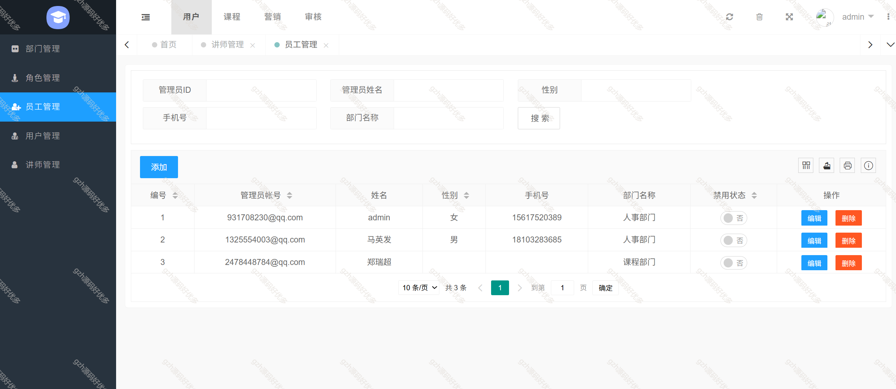

# springbootA381
springbootA381在线学习教育平台系统
 
## 查看主页获取源码

### 一、关键词

教育平台系统、在线学习教育平台系统

 

### 二、作品包含

源码+数据库+全套环境和工具资源+部署教程

 

### 三、项目技术

前端：前台 Vue, ECharts, Axios, ElementUI, 后台管理系统 Layui html
后端技术：Java、Spring Boot, MyBatis Plus, MySQL

  

 

### 四、运行环境（以下版本亲测，其他版本未知，请自测）

开发工具：IDEA/eclipse  + VSCODE

数据库：MySQL8

数据库管理工具：Navicat10以上版本

环境配置软件： JDK1.8 + Maven3.6.3

前端Nodejs：16

浏览器：谷歌浏览器

 

### 五、项目介绍

项目编号：springbootA381

基于Spring Boot的在线学习资源管理平台，前后端分离架构，教育机构和学习者的高效选择！集成课程管理、资源下载、用户积分等功能，助力教育数字化转型。

【角色与功能】
- 用户：注册、登录、课程预告、在线课程、资料下载、个人信息
- 管理员：部门、角色、用户、课程、资料等全面管理

 

### 六、运行截图

